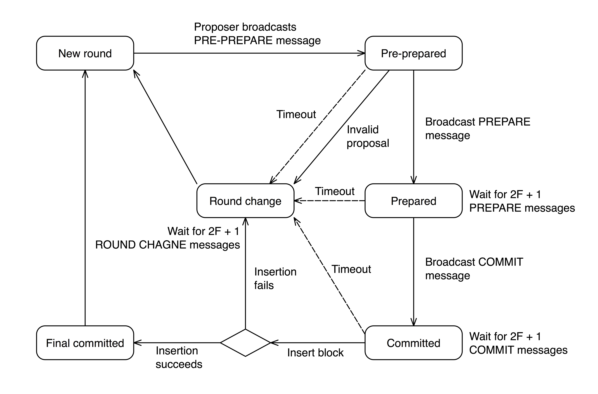

Tendermint Byzantine Fault Tolerance (TBFT)
=========================================
Some explanatory copy on Tendermint

Consensus State Transitions
---------------------------

The algorithm chooses a validator (the proposer), in a round robin fashion, which proposes a new block to the validators along with a `PRE-PREPARE` message. Upon reception of this new block and the `PRE-PREPARE` message, a validator verifies whether the `proposal` is valid and enters the `PRE-PREPARED` state, the validator broadcasts a `PREPARE` message. The `PREPARE` message is to ensure that validators are working on the same block and round. Upon receiving `2F+1` `PREPARE` message the validator enters the `PREPARED` state and broadcasts a `COMMIT` message. The `COMMIT` message informs the other peers that it has accepted the proposed block and is ready to insert the block into the chain. After receiving `2F+1 COMMIT` messages the validator enters the `COMMITTED` state and attempts to insert the block into the chain, if successful, the validators enters `FINAL COMMITTED` state and moves to the next sequence.

A sequence represents the current block on which validators are trying to reach consensus on, while a round consists of the states mentioned above in reaching consensus on the block. A sequence can contain multiple rounds, however, there is only one sequence per block. A round change can happen if there is a timeout, the proposal is invalid or the block insertion fails, upon these events the validators enter the `ROUND CHANGE` state and waits for `2F+1 ROUND CHANGE` messages before moving into a new round.