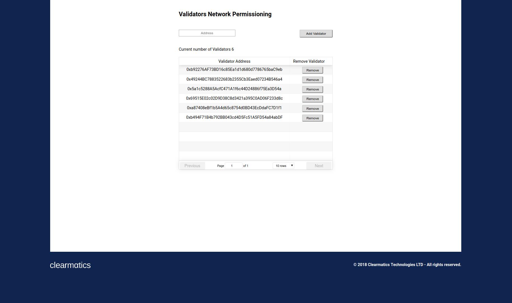
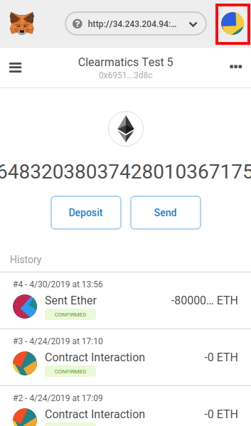
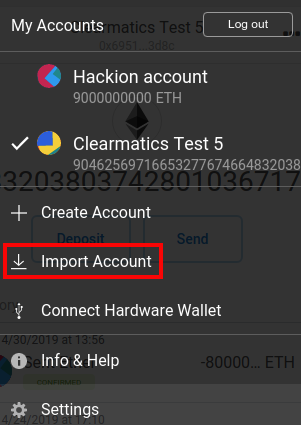
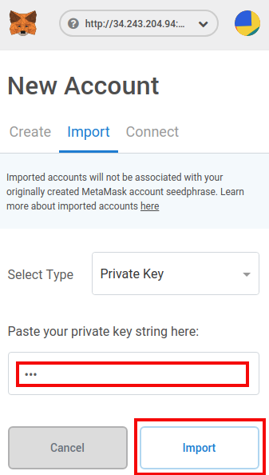
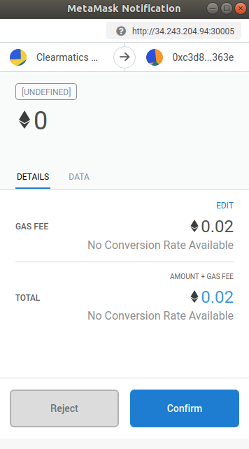

Validator DApp
====================================

The Validator DApp provides an interface to manage the validator set of nodes. To manage this set, it is possible to
add and remove nodes. To identify nodes, the `account address <https://github.com/ethereum/go-ethereum/wiki/Managing-your-accounts>`_ is used.

Prerequisites
---------------
* An active `Autonity <https://docs.autonity.io/hello-autonity/compose.html>` network
* `Git <https://git-scm.com/book/en/v2/Getting-Started-Installing-Git>`_
* `MetaMask (Chrome) <https://metamask.io/>`_
* `Docker <https://docs.docker.com/get-started/>`_ (Option 1)
* `npm <https://www.npmjs.com/get-npm>`_ (Option 2)

.. note:: MetaMask is having issues running on Firefox. This bug was reported back in August 2018 and we're awaiting a fix. Until then please use Chrome.

Start the DApp
---------------
There are two options to get the DApp up and running:

Option 1: Docker image (fastest)
^^^^^^^^^^^^^^^^^^^^^^^^^^^^^^^^
To get the DApp up and running quickly, you can directly tap into our Clearmatics image with

.. code-block:: none

    docker run -d -p 3000:3000 --name validator-dapp clearmatics/validator-dapp:latest

You can now find the DApp at http://localhost:3000/ in your browser. 

If you would like to run several DApps in parallel,
please change the first port number to avoid collisions, e.g. if you would like the Validator to show up on http://localhost:3001 you run
same command as above but *-p 3001:3000*. 

Option 2: Packet manager
^^^^^^^^^^^^^^^^^^^^^^^^
First, clone the Validator DApp `repository <https://github.com/clearmatics/validator-dapp>`_ with your terminal

.. code-block:: none

    git clone git@github.com:clearmatics/validator-dapp.git

Please write the following in your terminal before you proceed

.. code-block:: none

    cd validator-dapp

To build it locally, you need to install the dependencies first with

.. code-block:: none

    npm install

As long as the terminal doesn't display any error messages, you can now proceed with starting the app by writing

.. code-block:: none

    npm start

This should automatically open a tab in your Chrome browser which shows the user interface. If this is not the case,
you can see it at http://localhost:3000/. 

Does it work?
-------------
When the page has finished loading, you should see the user interface. In the user interface, you can see a list of current
validators.

Perhaps you have noticed that pressing the buttons does not seem to have any effect. That is because MetaMask refuses connection
from any invalid address. If your address is not part of the validator set, you will not be able to add or remove an address.
Access is allowed if you can demonstrate that your account has a private key which belongs to any of the addresses in the list.

.. note:: To add a new validator or remove an existing one, you need to have a private key that
    corresponds to an address in the validator set

.. note:: It is not possible to add an existing address since each validator has to be a different node
    

Import a private key
--------------------
To be a validator, you need to prove it to the network and this is where your private key comes into play. It is assumed that you
know the private key to at least one of the validators. To import it please follow these three steps:

Firstly, you need to open MetaMask and press the account icon, in the upper right corner of the dropdown menu:

Now you need to press *Import Account*.

Finally, you need to paste your private key in the field and press *Import*.

If the account loads correctly you should be good to go. You can try that your account is authenticated by attempting to remove a validator. By pressing *Remove*,
you should see a popup window from MetaMask asking you to confirm your transaction. If you see this window, that means that the connection was successfully authenticated.

When you do want to perform an actual change in the permissioning, you need to press *Confirm* to propagate your submission to the network.

Node management verification
----------------------------
Apart from the ability to display the current set of validators (or observers) through the user interface, we can verify it by network logs. In this example, we have filtered for any changes in the validator set. Before we make any changes to the permissioning,
we have 7 validators and the full set can seen in the logs as follows:

.. literalinclude:: all-validators-logs.txt
    :emphasize-lines: 2

After we have issued a request to remove the second validator through the DApp interface, we can see that the validator set has changed (and its size): 

.. literalinclude:: one-less-validator-logs.txt
    :emphasize-lines: 2

Finally, we add the same validator back to return to our initial state:

.. literalinclude:: back-to-all-validators-logs.txt
    :emphasize-lines: 3

Next steps
------------------
That's it. Since the contracts are pre-deployed as part of the Autonity client, you should now be able to adjust the network permissioning. If your MetaMask is properly set up and your
account has sufficient funds, you should be able to fully interact with the validation mechanism.

For further information about managing the deployed validator contract please visit `Soma <https://docs.autonity.io/network-perm/soma.html>`_.

